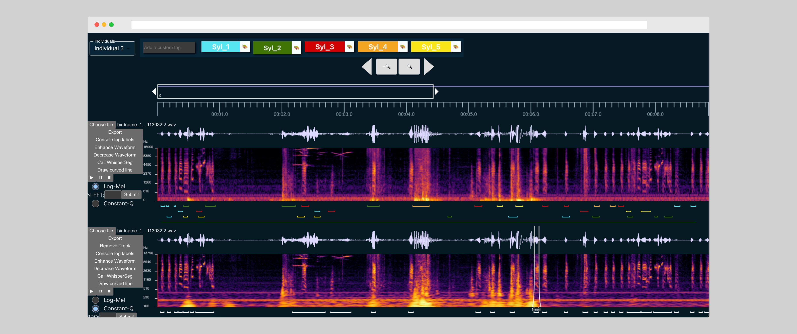

# Audio Annotation Web Interface




## 🦜[Live Demo](http://annotation.evolvinglanguage.ch/)🐒

## About this App

This audio annotation web interface offers an interactive user interface to simplify the annotation process for both human speech and animal vocalizations.
It is the frontend part of a full-stack application which was created as part of a [NCCR](https://www.liri.uzh.ch/en/services/collab/nccr.html) research project. 
It was written by [Alon Cohen](https://github.com/AlonCohen96/) and [Nianlong Gu](https://github.com/nianlonggu).

---

## Features

**Rich Annotation:** Annotate onset, offset, species, individual and vocalization type as well as frequency range of a vocalization.

**Multichannel support:** Handle and analyze multiple audio tracks simultaneously. Arrange or hide tracks freely. Multichannel audio will be split into separate tracks automatically.

**Spectrogram, Waveform, and Frequency Display:** Visualize audio data through spectrogram, waveform, and frequency displays.

**Customizable Spectrogram Options:** Choose between log-mel or constant-q spectrogram display options. Customize N-FFT and Bits Per Octave values for tailored spectrogram displays.

**Zoom to Millisecond Level:** Precisely analyze audio data by zooming in to the millisecond level.

**Fully Customizable:** Tailor the interface to your specific annotation needs, for multiple individuals and cluster names.

**Audio Playback:** Listen to audio samples directly within the interface for efficient annotation.

**Browser-Based:** As a User, access the interface seamlessly in your browser without additional dependencies or installation processes.

**Import and Export Data as CSV File:** Easily import and export annotation data in CSV format for compatibility with other tools and analysis.

**AI Annotation Support with WhisperSeg:** Utilize the WhisperSeg AI tool to automate annotation tasks, train and finetune custom models.

## Installation

1. Fork the repository to your local machine.
2. Navigate to the project directory react-annotation-interface.
3. Run the following command in the terminal to install dependencies:
```
npm install
```

## Starting a Development Server

```
npm run dev
```

## Create a Production Build
```
npm run build
```
## Set up the backend
Go over to the [backend repo](https://github.com/nianlonggu/human-in-the-loop-annotation-backend) and follow the installation guide there.  
Back in the frontend folder, navigate to or create your .env file, and add the following line:
```
VITE_BACKEND_SERVICE_ADDRESS=http://localhost:8050/
```

If necessary, replace 8050 with the port in which you are running the backend on your local machine.